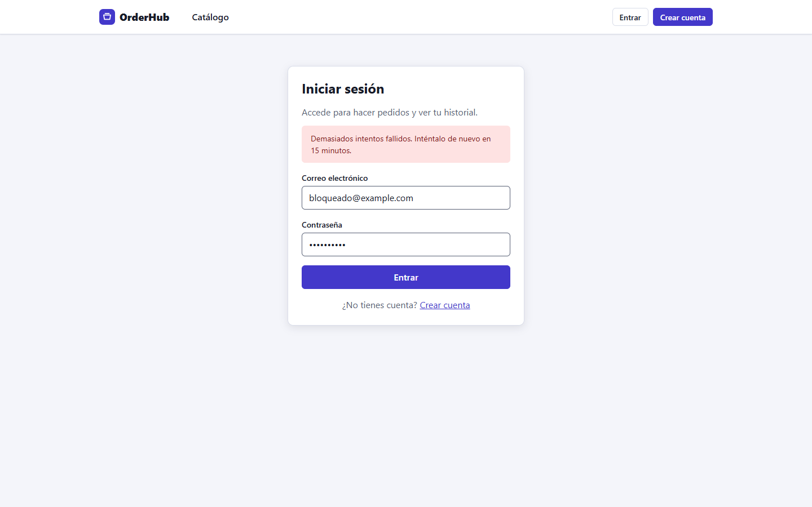
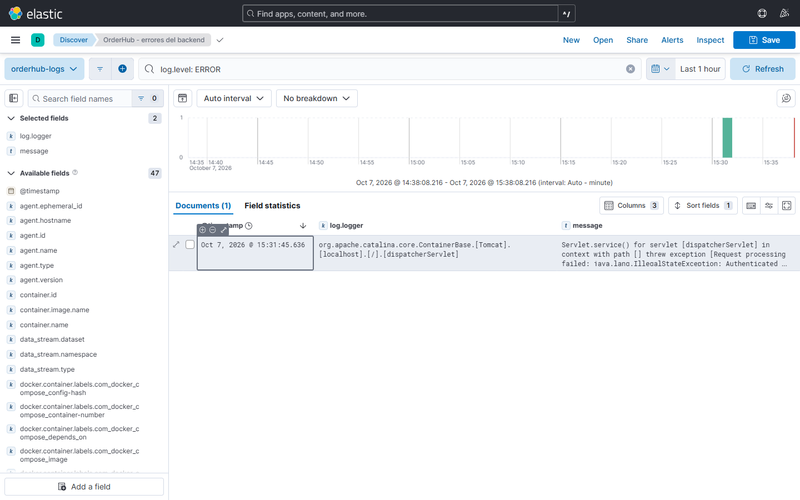
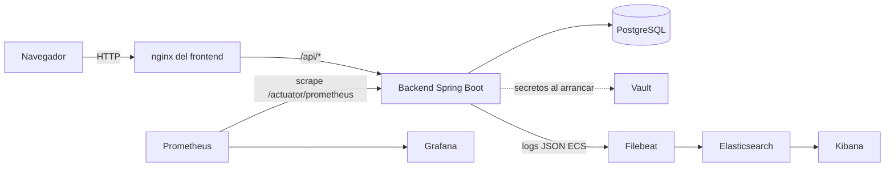

# OrderHub

[](https://github.com/alejo11102001/orderhub/actions/workflows/ci.yml)
[](https://github.com/alejo11102001/orderhub/actions/workflows/images.yml)

Plataforma de pedidos (mini e-commerce) construida como proyecto de aprendizaje
de extremo a extremo: aplicación, calidad, contenedores, CI/CD, observabilidad,
gestión de secretos, infraestructura como código y Kubernetes.


<details>
<summary>Más capturas</summary>

| | |
|---|---|
|  |  |
|  |  |
|  |  |

Vista móvil (390 px): 

Límite de intentos de login (429 con el tiempo de espera): 

Dashboard de Grafana (aprovisionado desde `infra/grafana/dashboards`, con paneles de pedidos creados y errores 5xx):


Kibana, búsqueda guardada «errores del backend» (`log.level: ERROR`; se importa con `infra/kibana/import-dataview.ps1`):



</details>

## Stack

| Capa | Tecnología |
|---|---|
| Backend | Java 21, Spring Boot 4, Spring Security (JWT), JPA, Flyway |
| Frontend | Angular 22 (signals), CSS propio con design tokens, Vitest |
| Base de datos | PostgreSQL 16 |
| Calidad | JUnit, Mockito, Testcontainers, JaCoCo, SonarQube |
| CI/CD | GitHub Actions, GHCR, Trivy |
| Contenedores | Docker, Docker Compose, Kubernetes (kind) |
| Observabilidad | Micrometer, Prometheus, Grafana, Filebeat, Elasticsearch, Kibana |
| Secretos | HashiCorp Vault (Compose), Secret de Kubernetes (kind) |
| IaC | Terraform, Ansible |

## Arquitectura



En Kubernetes un Ingress enruta `/api` al backend y el resto al frontend;
Vault, Prometheus, Grafana y ELK solo existen en Docker Compose.
Más detalle (módulos, flujo de un pedido, modelo de datos):
[docs/arquitectura.md](docs/arquitectura.md).

## Qué demuestra

- **Stock sin sobreventa**: descuento atómico con `UPDATE ... WHERE stock >= :qty`,
  verificado con un test de concurrencia (10 compradores, 1 unidad).
- **Transacciones**: un pedido con varias líneas es todo o nada.
- **Seguridad**: JWT, roles, aislamiento de pedidos entre usuarios (404 y no 403),
  rate limiting de login ([ADR 0009](docs/adr/0009-rate-limiting-login.md)), cabeceras de seguridad y CSP en nginx,
  contenedores sin root, NetworkPolicy, CORS por entorno y CSRF desactivado con justificación documentada.
- **Pipeline**: tests con reporte de cobertura, escaneo Trivy y publicación de imágenes con tag
  inmutable por commit; análisis Sonar opcional.
- **Kubernetes**: probes de liveness/readiness, backend con 2 réplicas,
  rolling update y rollback ([runbook](docs/operacion.md#runbook-de-rollback)).
- **Observabilidad**: métricas de negocio (`orders.created`), dashboard de Grafana versionado, alertas de Prometheus
  (backend caído, 5xx, heap) y logs ECS en Kibana.
- **Arranque reproducible**: admin y datos de demo se crean por configuración,
  sin SQL manual.

## Primeros pasos (Docker Compose)

Requisitos: Docker Desktop. Los comandos son para PowerShell.

1. **Variables locales**

   ```powershell
   cd infra/docker
   Copy-Item .env.example .env     # edita los valores; .env está en .gitignore
   ```

2. **Base de datos y Vault**

   ```powershell
   docker compose up -d postgres vault
   ```

3. **Secretos en Vault** (modo dev: hay que repetirlo cada vez que Vault se
   reinicia). Sustituye los marcadores por los valores de tu `.env`:

   ```powershell
   docker exec -e VAULT_ADDR=http://127.0.0.1:8200 -e VAULT_TOKEN=<VAULT_DEV_TOKEN> orderhub-vault `
     vault kv put secret/orderhub db.password=<DB_PASSWORD> jwt.secret=<JWT_SECRET>
   ```

4. **Backend y frontend**

   ```powershell
   docker compose up -d --build backend frontend
   ```

   Opcionalmente `docker compose up -d` levanta también Prometheus (con alertas), Grafana,
   Elasticsearch, Kibana y Filebeat. Para tener el Data View de logs en Kibana:

   ```powershell
   ./infra/kibana/import-dataview.ps1
   ```

5. **Abrir la app**: http://localhost:4200

Todos los puertos se publican **solo en `127.0.0.1`** (no son accesibles desde otras máquinas de la red).

| Servicio | URL |
|---|---|
| App | http://localhost:4200 |
| API (directo) | http://localhost:8080 |
| Grafana | http://localhost:3000 (usuario `admin`, contraseña `GRAFANA_PASSWORD`) |
| Prometheus | http://localhost:9090 |
| Kibana | http://localhost:5601 |
| Vault | http://localhost:8200 |

### Admin inicial

El backend crea un usuario **ADMIN** al arrancar si `APP_ADMIN_EMAIL` y
`APP_ADMIN_PASSWORD` (mínimo 12 caracteres; si es más corta, el arranque
falla) están definidas. Es idempotente y no modifica a un usuario que ya
exista. Ver [ADR 0007](docs/adr/0007-seed-admin.md).

- **Compose**: defínelas en `infra/docker/.env` y reinicia el backend.
- **Vault** (perfil por defecto, si `APP_ADMIN_PASSWORD` no está definida).
  `patch` conserva las demás claves; `put` las reemplazaría todas:

  ```powershell
  docker exec -e VAULT_ADDR=http://127.0.0.1:8200 -e VAULT_TOKEN=<VAULT_DEV_TOKEN> orderhub-vault `
    vault kv patch secret/orderhub admin.password=<min-12-caracteres>
  ```

- **Kubernetes**: añádelas al Secret (ver [Kubernetes](#kubernetes-kind)).

Con ese usuario, el menú muestra **Administración** (crear, editar y eliminar
productos). Los usuarios que se registran desde la app son `CUSTOMER`.

### Datos de demostración

Desactivados por defecto. Con `APP_DEMO_DATA=true` el backend crea 12 productos
realistas (precios en COP, algunos con poco stock y uno agotado). Es
idempotente por nombre: reiniciar no duplica, pero un producto de demo que
borres se vuelve a crear. También se activa con el perfil `demo`
(`SPRING_PROFILES_ACTIVE=demo`).

- **Compose**: `APP_DEMO_DATA=true` en `infra/docker/.env`, luego
  `docker compose up -d backend`.
- **Kubernetes**: cambia el valor de `APP_DEMO_DATA` a `"true"` en
  `infra/k8s/20-backend.yaml` y ejecuta `kubectl apply -f infra/k8s/20-backend.yaml`.

## Variables de entorno

Todos los valores de ejemplo son ficticios.

| Variable | Dónde | Descripción | Ejemplo |
|---|---|---|---|
| `DB_PASSWORD` | `.env` / Secret K8s | Contraseña de PostgreSQL. En Compose también se carga en Vault como `db.password`. Debe coincidir con la del volumen ya inicializado. | `cambia_esto` |
| `JWT_SECRET` | `.env` (→ Vault) / Secret K8s | Clave HS256 para firmar JWT. Mínimo 32 caracteres. | `cambia_esto_minimo_32_caracteres` |
| `GRAFANA_PASSWORD` | `.env` | Contraseña del usuario `admin` de Grafana. | `cambia_esto` |
| `VAULT_DEV_TOKEN` | `.env` | Token raíz del Vault en modo dev; el backend lo recibe como `VAULT_TOKEN`. | `cambia_esto` |
| `APP_ADMIN_EMAIL` | `.env` / Secret K8s | Correo del admin inicial. Opcional. | `admin@example.com` |
| `APP_ADMIN_PASSWORD` | `.env` / Secret K8s | Contraseña del admin inicial (≥ 12 caracteres). Opcional; alternativa: `admin.password` en Vault. | `cambia_esto_min_12_caracteres` |
| `APP_DEMO_DATA` | `.env` / Deployment | `true` crea los productos de demo. Por defecto `false`. | `true` |
| `SPRING_DATASOURCE_URL` | backend | URL JDBC. Por defecto `jdbc:postgresql://localhost:5432/orderhub`. | `jdbc:postgresql://postgres:5432/orderhub` |
| `VAULT_URI` / `VAULT_TOKEN` | backend (Compose) | Dirección y token de Vault. | `http://vault:8200` |
| `SPRING_PROFILES_ACTIVE` | backend | `k8s` desactiva Vault y lee secretos de variables; `demo` activa los datos de demo. | `k8s` |
| `APP_CORS_ALLOWED_ORIGINS` | backend | Orígenes CORS permitidos (`app.cors.allowed-origins`). Por defecto `http://localhost:4200`; el perfil `k8s` usa `http://localhost:8081`. | `http://localhost:4200` |
| `APP_JWT_EXPIRATION_MINUTES` | backend | Vida del token (`app.jwt.expiration-minutes`). Por defecto 60. | `60` |
| `APP_SECURITY_LOGIN_MAX_ATTEMPTS` | backend | Fallos de login/registro permitidos por IP+email en la ventana (`app.security.login-max-attempts`). Por defecto 5. | `5` |
| `APP_SECURITY_LOGIN_WINDOW_MINUTES` | backend | Ventana del límite (`app.security.login-window-minutes`). Por defecto 15. | `15` |
| `LOGGING_STRUCTURED_FORMAT_CONSOLE` | backend (Compose) | `ecs` emite logs JSON para Filebeat. | `ecs` |

La referencia de `.env` es [`infra/docker/.env.example`](infra/docker/.env.example).

## API: endpoints principales

Prefijo `/api`. Los errores usan `ProblemDetail` (RFC 9457).

| Método y ruta | Acceso | Descripción | Respuestas |
|---|---|---|---|
| `POST /auth/register` | Público | Crea un `CUSTOMER` (`email`, `password` 8–72). | 201; 400 validación; 409 correo existente; 429 demasiados fallos |
| `POST /auth/login` | Público | Devuelve `{accessToken, tokenType, expiresInSeconds}`. | 200; 401 credenciales; 429 demasiados fallos (con `Retry-After`) |
| `GET /products` | Público | Lista paginada (`page`, `size`, `sort`). | 200 |
| `GET /products/{id}` | Público | Un producto. | 200; 404 |
| `POST /products` | ADMIN | Crea un producto. | 201; 400; 403 |
| `PUT /products/{id}` | ADMIN | Actualiza un producto. | 200; 404 |
| `DELETE /products/{id}` | ADMIN | Elimina un producto. | 204; 404; 409 si tiene pedidos asociados |
| `POST /orders` | Autenticado | Crea un pedido `{items:[{productId, quantity}]}` y descuenta stock. | 201; 404 producto; 409 sin stock |
| `GET /orders` | Autenticado | Pedidos propios (un ADMIN ve todos), paginado. | 200 |
| `GET /orders/{id}` | Autenticado | Un pedido propio. | 200; 404 (también si es ajeno) |
| `POST /orders/{id}/pay` | Autenticado | `PENDING → PAID`. | 200; 409 estado inválido |
| `POST /orders/{id}/cancel` | Autenticado | `PENDING → CANCELLED` y devuelve stock. | 200; 409 estado inválido |

Fuera de `/api`: `GET /actuator/health/**` (público) y `GET /actuator/prometheus` (público en el backend, pero no se enruta
por nginx ni por el Ingress y los puertos de Compose están en loopback). En el perfil `k8s` solo se expone `health`.

## Tests

Backend (requiere Docker Desktop abierto: los `*IT` usan Testcontainers):

```powershell
cd backend
./mvnw test "-Dtest=*Test,*IT"
```

Frontend (Vitest):

```powershell
cd frontend
npx ng test --no-watch
npx ng build
```

Cobertura (JaCoCo): `./mvnw verify "-Dtest=*Test,*IT"` genera `backend/target/site/jacoco/index.html`.
La cobertura de líneas del backend es de **93,7 %** (297/317 líneas, sin exclusiones; medida en esta versión).

## CI/CD

- [`ci.yml`](.github/workflows/ci.yml): tests y `verify` del backend (con el reporte JaCoCo publicado como artefacto),
  `ng test` y `ng build` del frontend, con caché de Maven y npm.
  Incluye un job **opcional** de SonarQube que no bloquea: solo corre si existen los secrets `SONAR_TOKEN` y
  `SONAR_HOST_URL`; si no, se omite con un aviso. En local SonarQube corre con
  `infra/docker/docker-compose.sonar.yml` (no es accesible desde los runners de GitHub), por eso no se ejecuta en CI por defecto.
- [`images.yml`](.github/workflows/images.yml): construye backend y frontend, los escanea con Trivy (CRITICAL con parche),
  y publica `sha-<commit>` y `latest` en GHCR. No se dispara por cambios solo de `docs/`, `infra/k8s/`, `scripts/` o `*.md`.

## Kubernetes (kind)

Guía completa (crear clúster, Secret, aplicar, demo data, rolling update, rollback y problemas conocidos):
**[infra/k8s/README.md](infra/k8s/README.md)**. Resumen:

```powershell
kind create cluster --name orderhub --config infra/k8s/kind/kind-config.yaml
kubectl apply -f infra/k8s/00-namespace.yaml
kubectl create secret generic orderhub-secrets -n orderhub `
  --from-literal=DB_PASSWORD=<db> --from-literal=JWT_SECRET=<jwt-min-32-caracteres> `
  --from-literal=APP_ADMIN_EMAIL=admin@example.com --from-literal=APP_ADMIN_PASSWORD=<min-12-caracteres>
kubectl apply -f infra/k8s/
```

App en http://localhost:8081. `DB_PASSWORD` debe coincidir con la contraseña con la que se inicializó el volumen de Postgres.

### Tags inmutables y rolling update

Cada commit en `main` publica `ghcr.io/alejo11102001/orderhub-{backend,frontend}:sha-<commit>`
(y `latest` solo por conveniencia). Los manifiestos **fijan** `sha-<commit>`
([ADR 0005](docs/adr/0005-tags-inmutables.md)), así que un despliegue o un rollback siempre apunta a una imagen concreta.

```powershell
./scripts/update-image-tags.ps1 -Sha <commit>     # actualiza 20-backend.yaml y 30-frontend.yaml
git commit -am "feat(k8s): pin images to sha-<commit>"
kubectl apply -f infra/k8s/
kubectl -n orderhub rollout status deployment/backend
```

El backend (2 réplicas, con *readiness* y *liveness probes*) hace un *rolling update*: Kubernetes no retira un pod
viejo hasta que el nuevo responde `/actuator/health/readiness`. Para volver atrás:
`kubectl -n orderhub rollout undo deployment/backend`. Verificación y reconciliación con Git en
[docs/operacion.md](docs/operacion.md#runbook-de-rollback).

## Documentación

- [Arquitectura](docs/arquitectura.md): módulos, flujo de un pedido, modelo de datos.
- [Operación](docs/operacion.md): métricas, logs, Vault, runbook de rollback.
- [Seguridad](docs/seguridad.md): modelo de amenazas, decisiones y límites.
- [ADRs](docs/adr): decisiones de diseño 0001–0009.

## Limitaciones conocidas

**Seguridad e infraestructura**

- Vault en modo dev con token raíz y datos en memoria.
- Un Secret de Kubernetes solo está codificado en base64.
- Sin TLS (todo es HTTP), por lo que no hay HSTS; la CSP necesita `style-src 'unsafe-inline'` por cómo Angular inserta estilos.
- Elasticsearch, Kibana y Prometheus sin autenticación (solo entorno local, puertos en loopback).
- El rate limiting de login es **por instancia** y en memoria ([ADR 0009](docs/adr/0009-rate-limiting-login.md)): con 2 réplicas el límite efectivo es mayor y se reinicia con el pod; no hay bloqueo de cuentas ni recuperación de contraseña.
- Sin refresco ni revocación de tokens; el frontend no cierra la sesión al expirar el token (las peticiones devuelven 401).
- El token de un usuario que ya no existe en la base de datos provoca un 500 al crear pedidos (no hay endpoint para borrar usuarios, pero ocurre si se borran a mano).
- `images.yml` publica imágenes en cada push a `main` sin esperar a que CI pase.
- Las NetworkPolicy solo restringen tráfico entrante y dependen de que el CNI las aplique (kindnet lo hace).
- Prometheus, Grafana y ELK no están desplegados en kind. El dashboard de Grafana exige Grafana ≥ 13 y su panel *Response Time* sigue vacío.

**Producto**

- El pago es un cambio de estado: no hay pasarela de pago.
- Un pedido `PENDING` retiene su stock sin caducar.
- El carrito vive en memoria: se pierde al recargar la página.
- Un ADMIN ve todos los pedidos en «Mis pedidos».
- El stock mostrado en el carrito es el de cuando se cargó el catálogo; el 409 del servidor es la fuente de verdad.
- Cambiar `APP_ADMIN_PASSWORD` no actualiza a un admin que ya existe.

## Roadmap

Lo que faltaría para llevarlo a producción (en orden aproximado de prioridad):

1. **Secretos**: Vault real con almacenamiento persistente y AppRole (o el gestor del proveedor) en lugar del modo dev.
2. **TLS**: certificados en el Ingress (cert-manager) y HSTS.
3. **Rate limiting distribuido**: límite compartido entre réplicas (Redis) o en el gateway/Ingress.
4. **Consistencia de eventos**: patrón *outbox* si se añaden integraciones o notificaciones asíncronas.
5. **GitOps**: despliegue con Argo CD y promoción de tags por entorno en lugar de `kubectl apply` manual.
6. **Calidad en CI**: SonarQube/SonarCloud accesible desde los runners y gate de calidad; escaneo de dependencias.
7. **Producto**: pasarela de pago real, caducidad de pedidos pendientes, carrito persistente y refresco de tokens.
