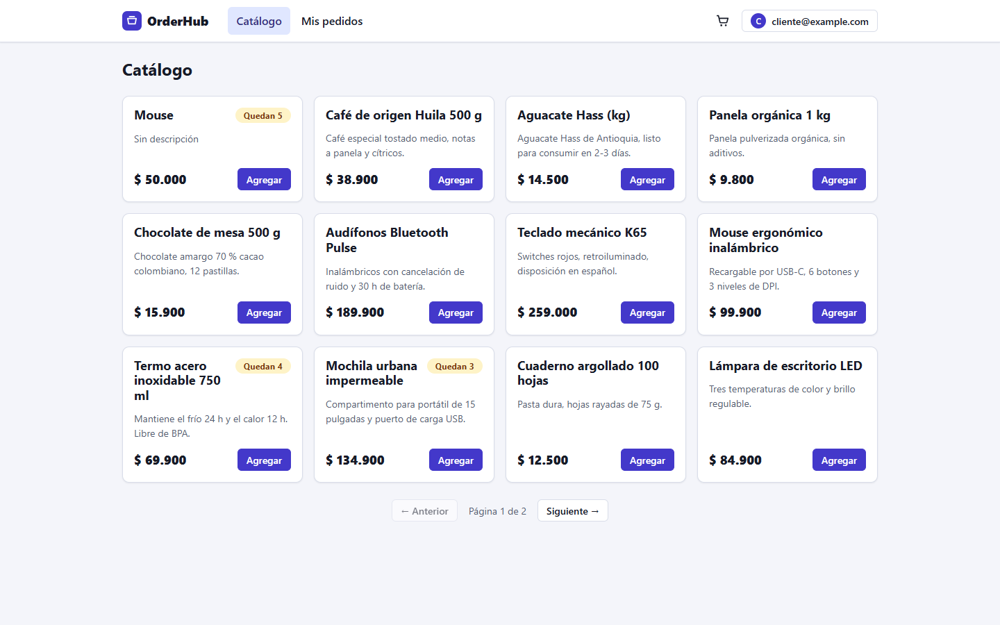
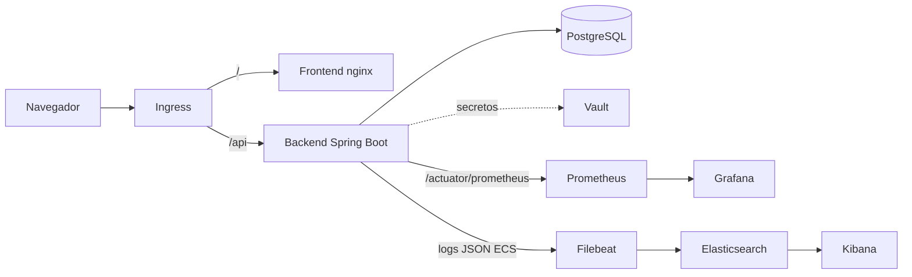

# OrderHub

Plataforma de pedidos (mini e-commerce) construida como proyecto de aprendizaje
de extremo a extremo: aplicación, calidad, contenedores, CI/CD, observabilidad,
gestión de secretos, infraestructura como código y Kubernetes.

## Stack

| Capa | Tecnología |
|---|---|
| Backend | Java 21, Spring Boot 4, Spring Security (JWT), JPA, Flyway |
| Frontend | Angular 22 (signals), Vitest |
| Base de datos | PostgreSQL 16 |
| Calidad | JUnit, Mockito, Testcontainers, JaCoCo, SonarQube |
| CI/CD | GitHub Actions, GHCR, Trivy |
| Contenedores | Docker, Docker Compose, Kubernetes (kind) |
| Observabilidad | Micrometer, Prometheus, Grafana, Filebeat, Elasticsearch, Kibana |
| Secretos | HashiCorp Vault |
| IaC | Terraform, Ansible |

## Arquitectura

## Arquitectura

## Qué demuestra

- **Stock sin sobreventa**: descuento atómico con `UPDATE ... WHERE stock >= :qty`,
  verificado con un test de concurrencia (10 hilos, 1 unidad).
- **Transacciones**: un pedido con varias líneas es todo o nada.
- **Seguridad**: JWT, roles, aislamiento de pedidos entre usuarios (404 y no 403),
  CORS por entorno, CSRF desactivado con justificación documentada.
- **Pipeline**: tests, build, escaneo Trivy y publicación de imágenes con tag
  inmutable por commit.
- **Kubernetes**: probes de liveness/readiness, rolling update, rollback y
  resiliencia verificada al borrar pods.

## Ejecución

### Docker Compose

    cd infra/docker
    cp .env.example .env      # completa los valores locales
    docker compose up -d --build

- App: http://localhost:4200
- Grafana: http://localhost:3000
- Kibana: http://localhost:5601

Vault está en modo dev: tras reiniciarlo hay que volver a cargar los secretos.

### Kubernetes (kind)

    kind create cluster --name orderhub --config infra/k8s/kind-config.yaml
    kubectl apply -f infra/k8s/00-namespace.yaml
    kubectl create secret generic orderhub-secrets -n orderhub \
      --from-literal=DB_PASSWORD=... --from-literal=JWT_SECRET=...
    kubectl apply -f infra/k8s/

App en http://localhost:8081.

### Tests

    cd backend && ./mvnw verify
    cd frontend && npm test

## Decisiones de diseño

Ver [docs/adr](docs/adr).

## Limitaciones conocidas

- Vault en modo dev con token raíz (en producción: AppRole + almacenamiento persistente).
- Actuator/Prometheus y Elasticsearch sin autenticación (solo entorno local).
- SonarQube se ejecuta en local, no en CI.
- Kubernetes es excesivo para este tamaño; se usó para aprender.
- Sin rate limiting en el login.