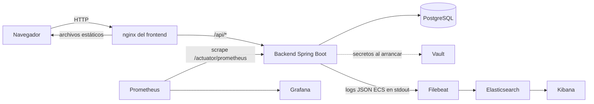
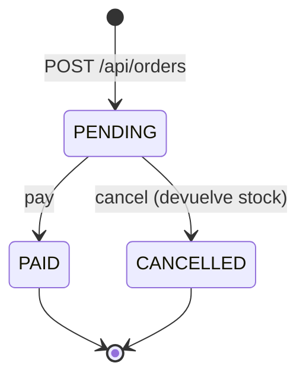
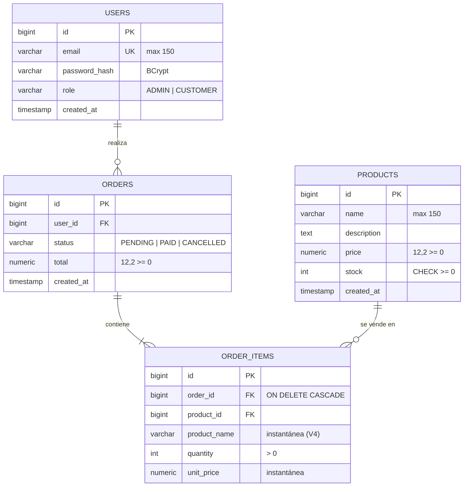

# Arquitectura

OrderHub es un monolito modular (ver [ADR 0001](adr/0001-monolito-modular.md)):
un backend Spring Boot con un paquete por dominio, un frontend Angular servido
por nginx y una base de datos PostgreSQL.

## Vista general



En Kubernetes, el Ingress enruta `/api` y `/actuator/health` al backend y el
resto al frontend. Prometheus, Grafana, ELK y Vault **solo existen en Docker
Compose**; el perfil `k8s` desactiva Vault y toma los secretos de un `Secret`.

## Módulos del backend

Paquete base: `com.orderhub.backend`.

| Módulo | Responsabilidad | Piezas principales |
|---|---|---|
| `auth` | Registro, login, JWT, roles, seguridad HTTP | `AuthController`, `AuthService`, `SecurityConfig`, `User`, `Role`, `AdminSeeder` |
| `catalog` | CRUD de productos y consulta paginada | `ProductController`, `ProductService`, `ProductRepository`, `DemoDataSeeder` |
| `orders` | Crear, listar, pagar y cancelar pedidos; control de stock | `OrderController`, `OrderService`, `Order`, `OrderItem`, `OrderStatus` |
| `common` | Traducción de excepciones a `ProblemDetail` | `GlobalExceptionHandler` |

Reglas de dependencia: `orders` guarda `userId` y `productId` como
identificadores (sin relaciones JPA entre módulos), pero `OrderService` usa
`UserRepository` y `ProductRepository` directamente (excepción documentada en
el ADR 0001).

Los DTO son `record`s; la validación usa Bean Validation; la inyección es por
constructor (Lombok `@RequiredArgsConstructor`).

### Seguridad en una frase

Filtro JWT stateless (HS256). `/api/auth/**`, `GET /api/products/**` y
`/actuator/health/**` son públicos; escribir productos exige `ROLE_ADMIN`; el
resto exige autenticación. Detalle en [seguridad.md](seguridad.md).

## Flujo de un pedido, paso a paso

1. **Carrito (frontend).** El usuario agrega productos en el catálogo. El
   `CartService` (signals, en memoria) limita cada línea al stock conocido al
   cargar la página.
2. **Crear pedido.** `POST /api/orders` con `{"items":[{"productId":1,"quantity":2}]}`
   y la cabecera `Authorization: Bearer <jwt>`. El interceptor del frontend la
   añade.
3. **Autenticación.** Spring Security valida firma y expiración del JWT y
   convierte el claim `role` en la autoridad `ROLE_<role>`.
4. **Transacción única.** `OrderService.create` (`@Transactional`) resuelve el
   usuario por el email del token (`sub`) y, por cada línea:
   1. busca el producto (404 si no existe);
   2. descuenta el stock con
      `UPDATE products SET stock = stock - :qty WHERE id = :id AND stock >= :qty`
      ([ADR 0002](adr/0002-stock-atomico.md)); si afecta 0 filas lanza
      `InsufficientStockException`;
   3. copia nombre y precio al `OrderItem` (instantánea: cambiar el producto
      después no altera pedidos ya hechos) y acumula el total.
5. **Todo o nada.** Si cualquier línea falla, la transacción completa se
   revierte, incluido el stock ya descontado de otras líneas. El cliente
   recibe `409 Conflict`.
6. **Respuesta.** `201 Created` con el pedido en estado `PENDING`.
7. **Pagar.** `POST /api/orders/{id}/pay`: solo desde `PENDING` hacia `PAID`;
   otro estado devuelve 409. Es un cambio de estado: **no hay pasarela de pago**.
8. **Cancelar.** `POST /api/orders/{id}/cancel`: solo desde `PENDING`; devuelve
   el stock con `stock = stock + :qty` y pasa a `CANCELLED`.
9. **Visibilidad.** Un cliente solo ve sus pedidos. Pedir el de otro usuario
   responde 404 ([ADR 0003](adr/0003-404-en-pedidos-ajenos.md)). Un ADMIN ve y
   opera todos.



Un pedido `PENDING` mantiene su stock reservado indefinidamente (no hay
expiración automática).

## Modelo de datos

Esquema gestionado por Flyway (`backend/src/main/resources/db/migration`,
`V1`–`V4`; JPA corre con `ddl-auto=validate`). Nunca se edita una migración ya
aplicada: se crea la siguiente.



Notas:

- Los índices `idx_orders_user_id` e `idx_order_items_order_id` aceleran
  «mis pedidos» y la carga de líneas.
- `product_name` y `unit_price` son una instantánea al momento de la compra.
- Existe clave foránea `order_items.product_id → products.id` sin
  `ON DELETE`, así que **no se puede borrar un producto que ya tiene pedidos**
  (la API responde 500: no traduce la violación de clave foránea; ver «Limitaciones» en el README).
- Las marcas de tiempo se guardan en UTC sin zona (`TIMESTAMP`).

## Frontend

Angular 22 con componentes standalone y signals, estructura:

```
frontend/src/app
├── core/       servicios (auth, cart, product, order, toast), guards, interceptor
├── shared/     componentes reutilizables (pager, toast-container)
└── features/   auth (login, register), catalog, orders (cart, order-list), admin
```

El estado de sesión es un JWT en `sessionStorage`; el interceptor lo añade a
cada petición. `environment.apiUrl = '/api'`: en Compose y Kubernetes el
navegador habla con el mismo origen y nginx hace de proxy al backend, por lo
que no hay CORS en producción. Decisiones de diseño en el
[ADR 0008](adr/0008-diseno-frontend.md).
